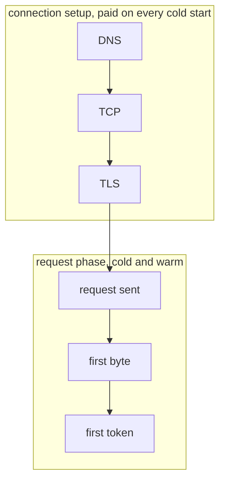

# ai-gateways-benchmark


<br />
<p align="center">Phase-by-phase latency benchmark for AI gateways, measured from your own
machine. Raw sockets, zero dependencies, Python 3 stdlib only.</p>

## Quickstart

```sh
cp config.example.json config.json   # endpoints and models
cp .env.example .env                 # your API keys
set -a; source .env; set +a
python3 bench.py config.json
```

### Setup

Each gateway is called with real credentials, so you need an API key for every
gateway in your `config.json` (Cloudflare also wants account and gateway IDs).
Fill them into `.env`. `bench.py` reads the `$VARS` from the environment at
request time, so no secret has to sit in the config file.

| Variable | Used by |
|---|---|
| `ANTHROPIC_API_KEY` | `anthropic`, `cloudflare-anthropic` |
| `AI_GATEWAY_API_KEY` | `vercel` |
| `OPENROUTER_API_KEY` | `openrouter` |
| `CLOUDFLARE_API_KEY`, `CLOUDFLARE_ACCOUNT_ID`, `CLOUDFLARE_GATEWAY_ID` | `cloudflare`, `cloudflare-anthropic` |

Drop any gateway from `config.json` whose keys you don't have.

> [!WARNING]
> The example runs 50 cold and 50 warm measurements against every gateway:
> hundreds of billable API calls and a few minutes of wall time. For a quick
> local check, drop `runs_cold` and `runs_warm` in `config.json` to something
> small like 5. 50 is just a sample size we picked for a steadier p90, not a
> magic number; with a few runs the p90 rides on your single slowest request,
> and past 50 or so the extra runs barely move it.

It prints per-run lines while it works, then a p50 table ready to paste,
receipt headers per gateway, and dumps raw per-run results to
`results-<timestamp>.json`:

```
| Gateway         | DNS | TCP | TLS  | TTFB   | TTFT   | Cold e2e TTFT | Warm TTFB | Warm TTFT |
|-----------------|-----|-----|------|--------|--------|---------------|-----------|-----------|
| provider-direct | 4.2 | 8.0 | 11.3 |  672.4 |  673.5 |  704.0        |  602.5    |  602.6    |
| gateway-a       | 3.1 | 9.0 | 17.6 |  800.2 |  800.6 |  848.8        |  580.3    |  580.7    |
| gateway-b       | 4.1 | 7.0 | 12.0 | 1240.0 | 1240.1 | 1277.3        | 1302.4    | 1303.8    |
```

## What it measures



| Metric | What it measures |
|---|---|
| `dns` | Hostname resolution |
| `tcp` | Socket connect |
| `tls` | Full TLS handshake (fresh context per connection, no session resumption) |
| `ttfb` | Request fully sent → first response byte |
| `ttft` | Request fully sent → first content token in the SSE stream |
| `cold e2e ttft` | `dns + tcp + tls + ttft`, what a short-lived process pays end to end |
| `warm ttfb / ttft` | Second request on an already-open connection (the connection-pool case) |

Runs interleave round-robin across gateways to cancel time-of-day drift,
and request-id headers (`x-vercel-id`, `cf-ray`, …) are captured as
receipts.

## Configuration

`config.json` accepts any OpenAI-compatible chat-completions endpoint, plus
per-gateway overrides for the auth header and extra headers. `$VARS` in
`path`, `auth_value`, and `extra_headers` are expanded from the
environment, so account and gateway IDs can live in `.env` rather than the
config (e.g. `/v1/$CLOUDFLARE_ACCOUNT_ID/$CLOUDFLARE_GATEWAY_ID/...`).

The example config ships a provider-direct baseline row and both Cloudflare
shapes: `cloudflare` uses the OpenAI-compatible `compat` endpoint, which
requires provider keys stored in the gateway (BYOK), while
`cloudflare-anthropic` passes the provider key per request instead, so it
works without stored keys.

## Read this before publishing numbers

> [!IMPORTANT]
> Results are a property of your vantage point (region, ISP, transit) and
> of the moment you measured. They are not a global ranking. The same
> config from another country, or another day, can invert the table.

- `cold` means a new connection, not a provider-side cold start.
- A config that proxies one gateway through another measures the whole
  chain, never the outer gateway alone.
- Each metric reports p50, p90, and IQR (R-7 percentiles) over `n` successful
  runs. A small `n` still means a noisy p90, so check `n` and the raw JSON for
  the full spread.
- Summary statistics include successful runs only. Inspect and disclose the
  error count; a row with failed attempts is not comparable without that
  context.
- A gateway that dynamically selects an upstream measures that routing
  policy, not isolated gateway overhead.
- The result records what each run aimed at (`target.routing`: the pinned
  provider and model) and the model each gateway actually served
  (`observed_route`). A gateway that echoes only the model alias, not the
  dated snapshot, shows up there.
- Keep the config and benchmark commit with the raw JSON. The current result
  file does not contain enough context to reproduce a run by itself.

The full measurement doctrine, including baselines, topology naming, and
how to present results honestly: **[METHODOLOGY.md](METHODOLOGY.md)**.

## License

MIT
